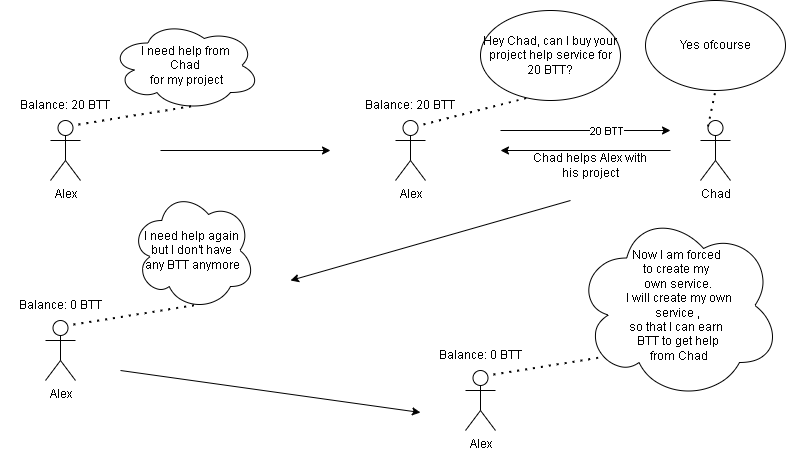

# Football Marketplace
Ethereum Blockchain Dapp that aims to improve teamwork within an organization.

Every participant on the blockchain can create, sell and buy services from others (coworkers or teammates). 
It forces each participant to contribute to the team with his own services the following way.  
The exchange of money will happen through an ERC20 token ("BTT", "Bulls Team Token").  

This is how the mechanism works:

Demo: http://bullsmarketplace.herokuapp.com  
Linkedin post: https://www.linkedin.com/feed/update/urn:li:activity:6936809892032765952/

